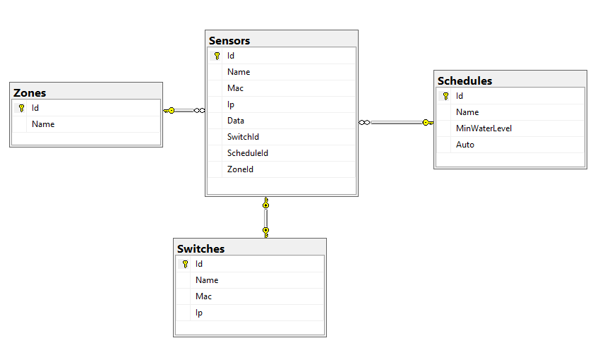
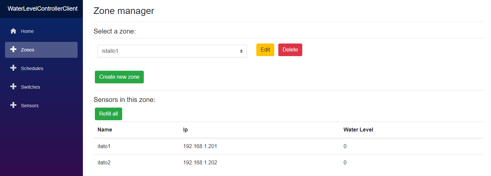
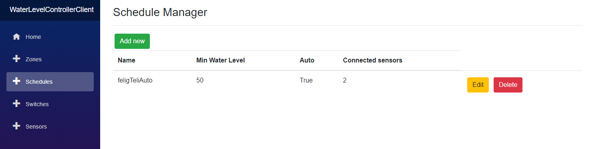
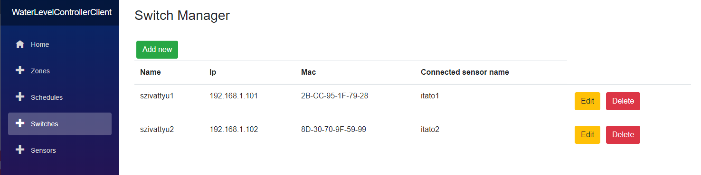
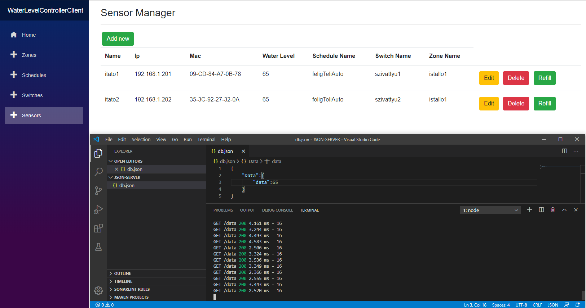

# Water Level Controller

## Adatbázis séma:

## Blazor felület bemutatása:

A `Zones` menüpont alatt tudjuk menedzselni a zónákat. Tudunk létrehozni újat, meglévőt módosítani és törölni.
Legördülő menüben ki tudjuk választani, hogy melyik zóna szenzorait szeretnénk kilistázni, ha ezt megtettük, akkor megjelennek a szenzorok és lehetőségünk adódik az összes szenzor újratöltésére (egy szenzor egy itatót szimbolizál).
A szenzorokról megjelenik pár információ: a neve, IP-címe és a szenzor által mért telítettség.

A `Schedules` menüpont alatt létre tudunk hozni ütemterveket, amiket később szenzorokhoz tudunk kötni. Itt meg tudjuk adni, hogy mi legyen az a víz küszöbszint, ami alatt a itató újratöltése megkezdődjön. Illetve be tudjuk állítani, hogy az újratöltés automatikus legyen vagy sem. A megjelenített adatok között látszik, hogy hány szenzor használja az egyes ütemterveket. Továbbá lehetőségünk van schedule-ok módosítására és törlésére.

A `Switches` menüpont alatt tudjuk menedzselni a vízellátó szerkezeteket, akiknek a szenzonorok szólnak, ha a vízszint nem megfelelő. Létre tudunk hozni új switch-eket: név, IP-cím és MAC-cím megadásával. A megjelenített adatok közt szerepel a switch-hez kapcsolt szenzor neve is (tehát, hogy ez a vízellátó szerkezet (pl.: szivattyú, elektorom vízszelep) melyik itatóhoz van kapcsolva).

A `Sensor` menü arra szolgál, hogy a szenzorainkat menedzselni tudjuk. Hozzá tudunk adni új szenzorokat: név, IP-cím és MAC-cím alapján, majd módosításkor lehetőségünk van legördülő menüből kiválasztani, hogy szenzorunk mely schedule-hoz, switch-hez és zone-hoz kapcsolódjon.
Itt nem kötelező egyiket sem beállítani. Például, ha szenzonrunkat nem szeretnénk schedule-hoz kapcsolni, mert mindig kézileg szeretnénk újratölteni, akkor nem rendelünk hozzá schedule-t.
Minden szenzonrt (azaz itatót) kézileg is újra tudunk tölteni a `Refill` gombra kattintva.

A képen látható továbbá, hogy Json-Server segítségével, a szenzorok pollozása történik. Jelengleg csak localhost van beállítva minden kéréshez, így együttesen változtatja minden szenzor által mért vízszint értékét.